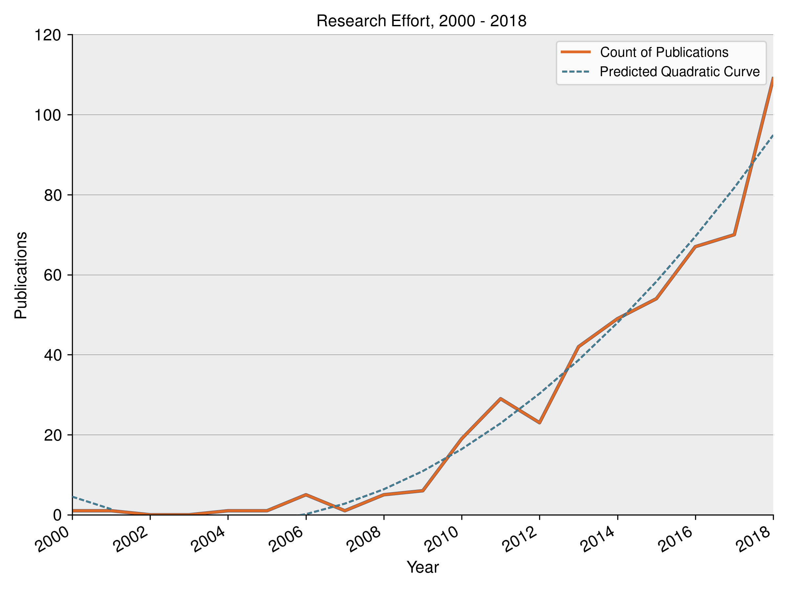

# Introduction

These are the materials comprising the scientometric analysis in _Engaging Citizens: A Review of Citizen Participation Strategies
for Climate Change Adaptation Since the Rio Earth Summit_. In order to re-create the analysis, you'll need to install the following Python packages, using Python **3.7.x**:

- jupyterlab == 0.35.6
- pandas == 0.24.0
- matplotlib == 1.16.0
- numpy == 1.16.2
- nltk == 3.4
- sklearn == 0.20.2
- xlrd == 1.2.0
- squarify == 0.4.2

# Analysis

When you've installed the packages, run `jupyter lab` or `jupyter notebook`. The primary analysis is contained in [WIREs.ipynb](WIREs.ipynb). A plaintext version of the dataset, derived from an ISI Web of Science search, can be found at [combined.csv](combined.csv)

# DOI

This analysis has a DOI, and a zipped version of this repository is permanently available at Zenodo:  

# License

All original code in this repository is licensed under the [Blue Oak Model License 1.0](LICENSE.md), and is free to use subject to its terms.

